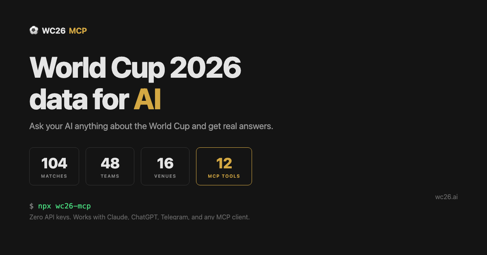

# wc26-mcp

[](https://www.npmjs.com/package/wc26-mcp)
[](https://opensource.org/licenses/MIT)
[](https://www.typescriptlang.org/)
[](https://modelcontextprotocol.io)

<p align="center">
  
</p>

Ask your AI anything about the 2026 World Cup and get real answers. 12 tools covering matches, teams, venues, city guides, fan zones, head-to-head records, visa info, and more. All data ships with the package. Zero API keys, zero external dependencies.

Works with **Claude Desktop** · **Claude Code** · **Cursor** · **Windsurf** · **ChatGPT** · **Telegram** · any MCP client

**[Website](https://wc26.ai)** | **[npm](https://www.npmjs.com/package/wc26-mcp)** | **[ChatGPT GPT](https://chatgpt.com/g/g-698d038f171481919ada44947304a196-world-cup-2026-companion)** | **[Telegram Bot](https://t.me/wc26ai_bot)** | **[MCP Registry](https://registry.modelcontextprotocol.io)**

## Quick Start

### Claude Desktop

Add to your `claude_desktop_config.json`:

```json
{
  "mcpServers": {
    "wc26": {
      "command": "npx",
      "args": ["-y", "wc26-mcp"]
    }
  }
}
```

### Claude Code

```bash
claude mcp add wc26 -- npx -y wc26-mcp
```

### Cursor

Add to `.cursor/mcp.json`:

```json
{
  "mcpServers": {
    "wc26": {
      "command": "npx",
      "args": ["-y", "wc26-mcp"]
    }
  }
}
```

### Windsurf

Add to `~/.codeium/windsurf/mcp_config.json`:

```json
{
  "mcpServers": {
    "wc26": {
      "command": "npx",
      "args": ["-y", "wc26-mcp"]
    }
  }
}
```

### ChatGPT

No setup needed — use the GPT directly:

**[Open World Cup 2026 Companion](https://chatgpt.com/g/g-698d038f171481919ada44947304a196-world-cup-2026-companion)**

### Telegram

No setup needed — message the bot directly:

**[Open @wc26ai_bot on Telegram](https://t.me/wc26ai_bot)**

12 slash commands: `/brief`, `/team`, `/matches`, `/group`, `/city`, `/venue`, `/history`, `/visa`, `/fanzones`, `/schedule`, and more.

### Other MCP Clients

The server communicates over stdio using the [Model Context Protocol](https://modelcontextprotocol.io):

```bash
npx -y wc26-mcp
```

## Tools

| Tool | Description | Filters |
|------|-------------|---------|
| `what_to_know_now` | Zero-query temporal briefing — detects tournament phase and returns the most relevant info for today | `date`, `timezone` |
| `get_team_profile` | Coach, key players, playing style, World Cup history, and qualifying summary for any team | `team` |
| `get_matches` | Query matches with enriched team names, flags, venue details, and timezone conversion | `date`, `date_from`, `date_to`, `team`, `group`, `venue`, `round`, `status`, `timezone` |
| `get_teams` | All 48 qualified nations with FIFA rankings and confederations | `group`, `confederation`, `is_host` |
| `get_groups` | Group details with teams, venues, and match schedules | `group` |
| `get_venues` | 16 stadiums across USA, Mexico, and Canada with weather data | `country`, `city`, `region` |
| `get_city_guide` | Travel guide for any host city — highlights, transit, food, things to do, local tips | `city` |
| `get_historical_matchups` | Head-to-head World Cup history between any two teams with aggregate stats and narrative | `team_a`, `team_b` |
| `get_nearby_venues` | Find venues near a given venue, sorted by distance in miles/km | `venue`, `limit` |
| `get_schedule` | Tournament schedule organized by date with timezone conversion | `date_from`, `date_to`, `timezone` |
| `get_visa_info` | Entry requirements (visa, ESTA, eTA) for any team's nationals entering host countries | `team`, `host_country` |
| `get_fan_zones` | Official FIFA Fan Festival locations across all 16 host cities with capacity, hours, activities, and transit tips | `city`, `country`, `venue_id` |

## Example Prompts

> "Brief me on the World Cup"

> "Tell me about Argentina's squad and playing style"

> "When does the USA play their first match?"

> "Show me tomorrow's matches in my timezone (America/New_York)"

> "What's the World Cup history between Argentina and England?"

> "Give me a city guide for Dallas"

> "Where are the fan zones in New York?"

> "Do Iranian fans need a visa to attend matches in the US?"

> "What venues are closest to MetLife Stadium?"

## Data

| | Count | Details |
|---|---|---|
| Matches | 104 | Group stage + knockout, all in UTC (timezone conversion supported) |
| Teams | 48 | 42 confirmed, 6 TBD (playoffs March 26 & 31) |
| Venues | 16 | USA (11), Mexico (3), Canada (2) with weather data |
| Team profiles | 48 | Coach, key players, style, WC history |
| City guides | 16 | Transit, food, attractions, local tips |
| Historical matchups | 30 | Head-to-head WC records with narrative |
| Fan zones | 18 | All host cities, capacity, hours, transport |
| Visa entries | 42 | All confirmed nationalities across 3 host countries |

Tournament: **June 11 - July 19, 2026**

## Contributing

This is an open source project under the MIT license. Issues and PRs welcome at [github.com/jordanlyall/wc26-mcp](https://github.com/jordanlyall/wc26-mcp).

## License

MIT
